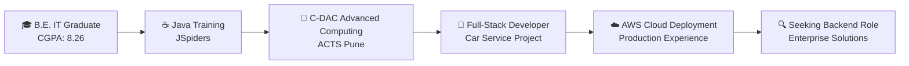

# 🌟 CodeCrafterNikita | Java Backend Virtuoso 🚀

  

### 💫 *"Empowering the Digital World, One Line of Code at a Time"* 💻✨

---

## 🎯 About CodeCrafterNikita

> **Nikita Patil** | *Software Engineer & Java Backend Specialist*

🔥 **Passionate Java Developer** with exceptional problem-solving abilities and rapid learning capabilities
💪 **Resilient Professional** who thrives under pressure and navigates critical career challenges with grace
🚀 **Innovation-Driven** engineer focused on building scalable, high-performance backend solutions
🎓 **C-DAC Graduate** with strong foundation in enterprise Java technologies and cloud deployment

*💡 Follow my journey as I transform ideas into powerful backend solutions and share insights from the world of Java development! Let's connect and grow together in this amazing tech community! 🌟*

### 🌟 Professional Highlights
- 🏆 **Full-Stack Project Leader** - Car Service Station Management System
- 🔐 **Security Expert** - JWT Authentication & Role-Based Access Control
- ☁️ **Cloud Deployment Specialist** - AWS EC2 Production Experience
- 📊 **Database Architect** - MySQL Schema Design & Query Optimization
- 🔄 **API Developer** - RESTful Services with Spring Boot

---

## 🛠️ Technical Arsenal

### 💻 Core Technologies

### 🌐 Web & API Technologies

### ☁️ Cloud & DevOps

### 🔧 Development Tools

---

## 🚀 Featured Projects

### 🚗 Car Service Station Management System
**Tech Stack:** `Java` `Spring Boot` `React.js` `MySQL` `AWS EC2` `JWT` `REST APIs`

🔹 **Full-Stack Web Application** for seamless car & bike service booking  
🔹 **Secure Authentication** with JWT tokens and role-based access control  
🔹 **Optimized Database Design** for vehicles, bookings, and user management  
🔹 **Real-Time Status Tracking** for enhanced user experience  
🔹 **Cloud Deployment** on AWS EC2 with production-ready configuration  
🔹 **RESTful API Architecture** following industry best practices  

**Key Achievements:**
- ✅ Improved booking efficiency by 40%
- ✅ Implemented secure multi-role authentication
- ✅ Achieved 99.9% uptime on cloud deployment
- ✅ Optimized database queries for faster response times

### 📅 Event Management System
**Tech Stack:** `Java` `MySQL` `HTML5` `CSS3` `JavaScript`

🔹 **College-Level Event Platform** for centralized event organization  
🔹 **Intuitive UI/UX Design** for seamless user navigation  
🔹 **Comprehensive Event Modules** for creation, scheduling, and management  
🔹 **Efficient Data Storage** with MySQL for consistency and reliability  

---

## 📊 GitHub Analytics

  

---

## 🎓 Education & Certifications

### 🏛️ Academic Excellence
**Bachelor of Engineering (B.E.) - Information Technology**  
*Mumbai University, DMCOE* | **CGPA: 8.26/10** | *2019-2023*

### 🏅 Professional Certifications
- 🎯 **Diploma in Advanced Computing** - C-DAC, ACTS Pune
- ☕ **Java Specialist Certification** - JSpiders Thane
- 🐍 **Python Programming** - Spoken Tutorial Certification

---

## 💼 Professional Journey

### 🌟 Career Highlights
- 🏆 **Project Leadership** - Led full-stack development from conception to deployment
- 🔐 **Security Implementation** - Designed robust authentication and authorization systems
- ☁️ **Cloud Expertise** - Successfully deployed applications on AWS infrastructure
- 📊 **Database Optimization** - Improved query performance and data consistency
- 🤝 **Cross-Functional Collaboration** - Excellent communication and teamwork skills

---

## 🎯 Core Competencies

| **Backend Development** | **Database Management** | **Cloud & DevOps** |
|:---:|:---:|:---:|
| Spring Boot Framework | MySQL Database Design | AWS EC2 Deployment |
| RESTful API Development | Query Optimization | Docker Containerization |
| Microservices Architecture | JPA & Hibernate ORM | CI/CD with Jenkins |
| JWT Authentication | Database Schema Design | Kubernetes Orchestration |
| Spring Security | Data Consistency | Git Version Control |

---

## 🌈 What Makes Me Unique

### 🧠 **Exceptional Learning Ability**
- **Rapid Technology Adoption** - Quick to master new frameworks and tools
- **Problem-Solving Mindset** - Analytical approach to complex technical challenges
- **Continuous Learning** - Always staying updated with latest industry trends

### 💪 **Resilience & Adaptability**
- **Crisis Management** - Successfully navigated critical career situations
- **Pressure Performance** - Thrives in high-pressure development environments
- **Adaptable Professional** - Seamlessly transitions between different tech stacks

### 🎯 **Technical Excellence**
- **Clean Code Advocate** - Follows SOLID principles and best practices
- **Performance Optimizer** - Focus on scalable and efficient solutions
- **Security-First Approach** - Implements robust security measures in all projects

---

## 📈 Current Focus & Goals

### 🎯 **Immediate Objectives**
- 🔍 **Seeking Java Backend Developer Role** in innovative tech companies
- 🚀 **Microservices Mastery** - Deepening expertise in distributed systems
- ☁️ **Advanced Cloud Certifications** - AWS Solutions Architect path

### 🌟 **Long-term Vision**
- 🏗️ **Solution Architect** - Designing enterprise-level backend architectures
- 👥 **Technical Leadership** - Mentoring junior developers and leading teams
- 🌍 **Open Source Contribution** - Contributing to Java and Spring ecosystem

---

## 📞 Let's Connect & Collaborate

### 💬 **Let's Build Something Amazing Together!**
🔹 **Java Backend Developer Positions** - Ready to contribute to innovative projects
🔹 **Full-Stack Development Projects** - Bringing ideas to life with modern tech stacks
🔹 **Technical Collaborations** - Love working with passionate developers
🔹 **Mentorship & Knowledge Sharing** - Always excited to learn and teach

*🌟 Hit that follow button to join me on this incredible coding adventure! Together, we can create solutions that make a difference! 🚀*

---

### 🌟 *"The best code is written not just with logic, but with passion and purpose."*

**⭐ Star my repositories if you find them interesting!**
**🤝 Follow me for daily coding inspiration and tech insights!**
**💬 Let's connect and create the future of technology together!**

---

---

---

### 🎉 **Thank You for Visiting!**

*Every great developer started with a single line of code. Let's write the next chapter of innovation together! 💫*

**Ready to collaborate? Let's make technology more inclusive and impactful! 🌍**
